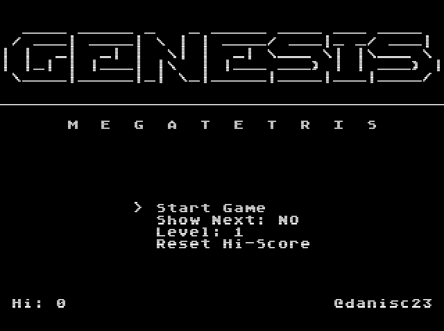

# GENESIS Megatetris

This is a text-character-based Tetris clone developed using SGDK, for Genesis/Megadrive (that's why the horrible name).

## How to Play

1. Download the rom from [out/rom.bin](out/rom.bin).
2. Open the game in a compatible Megadrive emulator such as Kgens.

## Controls

- **UP:** Drop Tetromino
- **DOWN:** Move Down Tetromino
- **LEFT & RIGHT:** Move Tetromino Horizontally
- **A & C:** Rotate Counter-clockwise
- **B:** Rotate Clockwise
- **START:** Pause

## How to Build

1. Install [SGDK](https://github.com/Stephane-D/SGDK/wiki/SGDK-Installation)
2. Run `%SGDK%\bin\make -f %SGDK%\makelib.gen` at the root of the project. (Replace `%SGDK%` with the path to your SGDK installation)

## Contributing

Feel free to contribute by forking the repository and submitting pull requests. Suggestions, bug fixes, and improvements are welcome!

This [TODO](TODO.md) file contains a list of things that I want to fix/improve/implemented in the future. If you want to contribute, you can pick one of those items and submit a pull request.

Along all these TODOs, there are some other things that can be improved, like the code style, the variable names, etc. This is the first project I do in C, so I'm sure there are a lot of things that can be improved. Also this began as a quick project to learn SGDK having everything in a single file, so the scope of a lot of variables and functions should be refactored, that also would help to avoid circular header dependencies.

Also probably I'm not using the best practices for the Genesis CPU and VDP management, so any help in that area would be appreciated.

Not everything has to be done in code! you can also help by creating sound effects and music for the game.

## License

This project is licensed under the  - see the [LICENSE](LICENSE) file for details.
TL;DR: You can use this project for non-commercial purposes as long as you give credit to the original author.

## Acknowledgments
- The current music is a YM2612 version of the [Sonic Adventure 2 - Hero Garden](https://www.youtube.com/watch?v=pevjY2Wb8zM) theme, made by [JXChip](https://www.youtube.com/@JXChip).